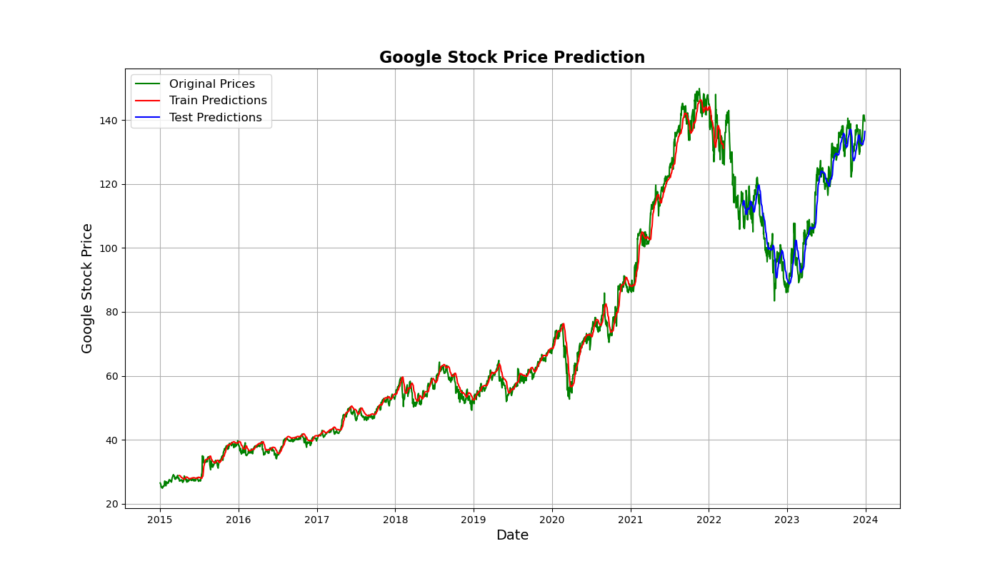

# 📈 Google Stock Price Prediction

> ⚠️ **Disclaimer:** This project is intended for educational and research purposes only. It does not constitute financial advice or recommendations to buy or sell any securities. Always consult with a financial advisor before making investment decisions.

---

## 🗂️ Table of Contents
- [Introduction](#introduction)
- [Dataset](#dataset)
- [Data Cleaning](#data-cleaning)
- [Model Training](#model-training)
- [Evaluation](#evaluation)
- [Results](#results)
- [How to Run](#how-to-run)
- [Dependencies](#dependencies)
- [Contributing](#contributing)
- [License](#license)

---

## 📘 Introduction

This project aims to predict the stock prices of Google (GOOGL) using advanced machine learning models. The primary objective is to generate accurate and timely predictions that could assist in making better-informed investment decisions.

---

## 📊 Dataset

The dataset used in this project contains historical stock price data for Google (GOOGL), with the following features:

- `Date`
- `Open`
- `High`
- `Low`
- `Close`
- `Volume`

The data can be sourced from reliable financial APIs or providers such as [Yahoo Finance](https://finance.yahoo.com/).

---

## 🧹 Data Cleaning

To ensure the quality and reliability of the model, the dataset underwent preprocessing which included:

- Removal of duplicate records
- Handling of missing values (imputation/filling)
- Conversion of dates to appropriate datetime formats
- Scaling of feature values for neural network training

---

## 🧠 Model Training

The primary model used in this project is a **Long Short-Term Memory (LSTM)** network due to its strong capability in learning temporal dependencies in time series data.

### Key Features:
- Sequence modeling using historical prices
- Tuned hyperparameters for better convergence
- Train/Test split with validation

---

## 📈 Evaluation

The model’s predictions were evaluated using the following performance metrics:

| Metric           | Description                                        |
|------------------|----------------------------------------------------|
| MSE (Mean Squared Error)       | Measures average squared difference between predicted and actual prices |
| RMSE (Root Mean Squared Error) | Square root of MSE; more interpretable due to units |
| R² Score        | Measures how well predictions approximate actual values |

---

## 📊 Results

The plot below shows the comparison between the actual and predicted Google stock prices:



The LSTM model was able to closely track the general trend of Google's stock price movements, indicating strong predictive capabilities.

---

## 🛠️ How to Run

1. Clone this repository:
   ```bash
   git clone https://github.com/yourusername/google-stock-price-prediction.git
   cd google-stock-price-prediction
